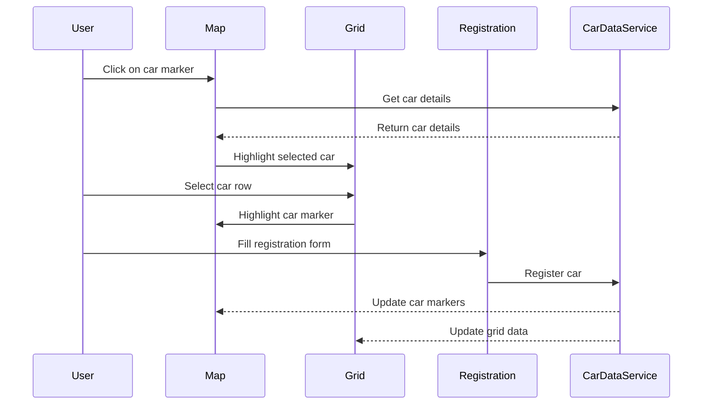
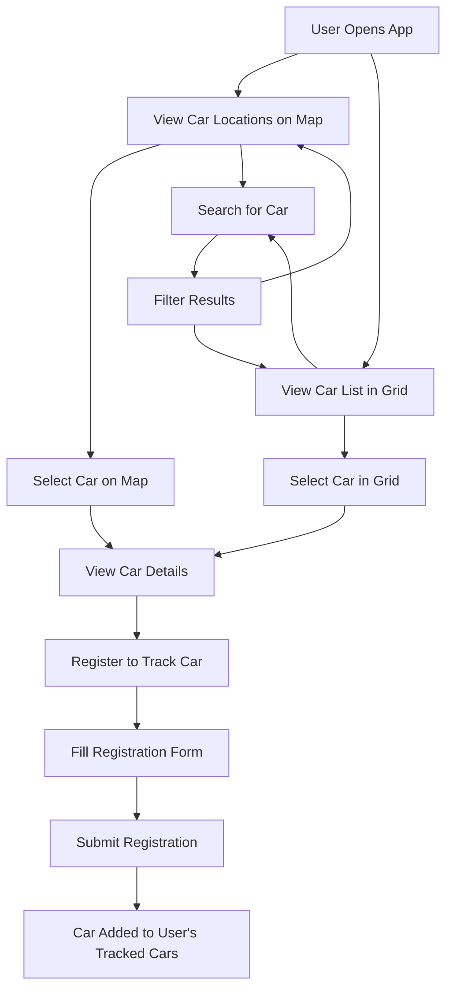

# Car Rental Tracking Application - Visual Mockup (Updated)

## Desktop Layout (Map Fullscreen)

```
+-----------------------------------------------------------------------+
|                                                                       |
|                                                                       |
|                                                                       |
|                                                                       |
|                                                                       |
|  +-------------------+                                                |
|  |                   |                                                |
|  |   Registration    |                                                |
|  |     Panel         |                                                |
|  |   (Draggable)     |                                                |
|  |                   |                                                |
|  |   [Form Fields]   |            Map View (Fullscreen)               |
|  |                   |                                                |
|  |   [Submit Button] |         (Car Location Markers)                 |
|  |                   |                                                |
|  |   [Minimize]      |                                                |
|  |                   |                                                |
|  +-------------------+                                                |
|                                                                       |
|                                                                       |
|                                                                       |
|                                                                       |
|  +-------------------------------------------------------------------+|
|  | Search: [                    ]                                    ||
|  +-------------------------------------------------------------------+|
|  |                                                                   ||
|  |                         Car Grid (AG Grid)                        ||
|  |                                                                   ||
|  | +-------+----------+------------+------------+----------------+   ||
|  | | Car ID | Car Name | Latitude   | Longitude  | Last Updated   |   ||
|  | +-------+----------+------------+------------+----------------+   ||
|  | | Data   | Data     | Data       | Data       | Data           |   ||
|  | | ...    | ...      | ...        | ...        | ...            |   ||
|  | +-------+----------+------------+------------+----------------+   ||
|  |                                                                   ||
|  +-------------------------------------------------------------------+|
|                                                                       |
+-----------------------------------------------------------------------+
```

## Mobile Layout (Map Fullscreen)

```
+-----------------------------------+
|                                   |
|                                   |
|                                   |
|                                   |
|                                   |
|          Map View                 |
|       (Fullscreen)                |
|                                   |
|    (Car Location Markers)         |
|                                   |
|                                   |
|                                   |
|  +--+                             |
|  |R |  <- Minimized Registration  |
|  +--+     Panel (Draggable)       |
|                                   |
|                                   |
|  +-----------------------------+  |
|  | Search: [               ]   |  |
|  +-----------------------------+  |
|  |                             |  |
|  |       Car Grid (AG Grid)    |  |
|  |                             |  |
|  +-----------------------------+  |
|                                   |
+-----------------------------------+
```

## Layout Strategy (Updated)

The application will use a fullscreen map as the base layer, with overlays for the grid and registration panel:

1. **Map Component**
   - Takes up the entire screen (100% width and height)
   - Serves as the base layer for the application
   - Displays car markers based on their coordinates

2. **Car Grid Component**
   - Positioned as an overlay at the bottom of the screen
   - Semi-transparent background to maintain visibility of the map
   - Collapsible to maximize map view when needed
   - Includes search functionality at the top

3. **Registration Panel**
   - Positioned as a draggable overlay on the left side
   - Can be minimized to a small icon
   - Semi-transparent background
   - Z-index ensures it appears above other elements

## CSS Implementation (Updated)

```css
.app-container {
  position: relative;
  width: 100vw;
  height: 100vh;
  overflow: hidden;
}

.map-container {
  position: absolute;
  top: 0;
  left: 0;
  width: 100%;
  height: 100%;
  z-index: 1;
}

.grid-container {
  position: absolute;
  bottom: 0;
  left: 0;
  width: 100%;
  height: 300px; /* Adjustable height */
  background-color: rgba(255, 255, 255, 0.9);
  z-index: 2;
  box-shadow: 0 -2px 10px rgba(0, 0, 0, 0.1);
  transition: transform 0.3s ease;
}

.grid-container.collapsed {
  transform: translateY(calc(100% - 40px));
}

.registration-container {
  position: absolute;
  top: 20px;
  left: 20px;
  width: 300px;
  background-color: rgba(255, 255, 255, 0.9);
  z-index: 3;
  border-radius: 4px;
  box-shadow: 0 2px 10px rgba(0, 0, 0, 0.1);
}

.registration-container.minimized {
  width: 40px;
  height: 40px;
  overflow: hidden;
}

/* Responsive adjustments */
@media (max-width: 768px) {
  .grid-container {
    height: 250px;
  }
  
  .registration-container {
    width: 250px;
  }
}
```

## Component Interactions (Unchanged)



## User Flow (Unchanged)



## Additional Features for Fullscreen Map

1. **Grid Toggle Button**
   - Button to collapse/expand the grid overlay
   - Allows maximizing the map view when needed

2. **Map Controls**
   - Zoom controls positioned to avoid overlapping with panels
   - Layer controls for different map views (satellite, street, etc.)

3. **Car Marker Clustering**
   - Implement clustering for areas with many cars
   - Improves visibility and performance on the fullscreen map

4. **Map Filters**
   - Filter controls to show/hide different car statuses
   - Directly on the map interface for quick filtering