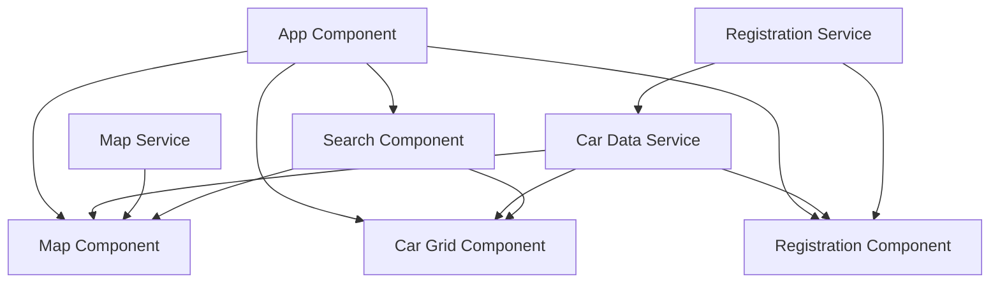

# Car Rental Tracking Application - Technical Specification (Updated)

## Component Diagram



## Data Models

### Car Entity
```typescript
interface Car {
  id: string;           // Unique identifier for the car
  name: string;         // Display name of the car
  latitude: number;     // Current latitude position
  longitude: number;    // Current longitude position
  status: CarStatus;    // Current status of the car
  model?: string;       // Optional car model information
  year?: number;        // Optional manufacturing year
  licensePlate?: string; // Optional license plate number
  lastUpdated: Date;    // Timestamp of last location update
}

enum CarStatus {
  AVAILABLE = 'available',
  RENTED = 'rented',
  MAINTENANCE = 'maintenance',
  INACTIVE = 'inactive'
}
```

### User Entity (for Registration)
```typescript
interface User {
  id: string;           // Unique identifier for the user
  name: string;         // User's name
  email: string;        // User's email address
  phone?: string;       // Optional phone number
  registeredCars: string[]; // Array of car IDs registered to this user
}
```

## API Endpoints

The application would interact with a backend service through the following RESTful API endpoints:

### Car Management
- `GET /api/cars` - Retrieve all cars
- `GET /api/cars/:id` - Retrieve a specific car by ID
- `POST /api/cars` - Create a new car entry
- `PUT /api/cars/:id` - Update a car's information
- `DELETE /api/cars/:id` - Remove a car from the system

### User Management
- `GET /api/users` - Retrieve all users
- `GET /api/users/:id` - Retrieve a specific user
- `POST /api/users` - Register a new user
- `PUT /api/users/:id` - Update user information
- `POST /api/users/:id/cars/:carId` - Register a car to a user
- `DELETE /api/users/:id/cars/:carId` - Unregister a car from a user

### Location Updates
- `POST /api/cars/:id/location` - Update a car's location
- `GET /api/cars/locations` - Get all car locations (optimized endpoint)

## Zone-less Angular Implementation Details

### Bootstrap Configuration
```typescript
// main.ts
import { bootstrapApplication } from '@angular/platform-browser';
import { AppComponent } from './app/app.component';
import { appConfig } from './app/app.config';

bootstrapApplication(AppComponent, {
  ...appConfig,
  providers: [
    ...appConfig.providers,
    provideZonelessChangeDetection()
  ]
}).catch(err => console.error(err));
```

### Manual Change Detection
```typescript
// Example component with manual change detection
import { Component, ChangeDetectorRef, inject } from '@angular/core';

@Component({
  selector: 'app-car-grid',
  templateUrl: './car-grid.component.html',
  changeDetection: ChangeDetectionStrategy.OnPush
})
export class CarGridComponent {
  private cdr = inject(ChangeDetectorRef);
  
  // When data changes and needs to be reflected in the UI
  updateGrid(cars: Car[]): void {
    this.cars = cars;
    this.cdr.detectChanges();
  }
}
```

### Signal-based State Management
```typescript
// car-data.service.ts
import { Injectable, signal, computed } from '@angular/core';

@Injectable({
  providedIn: 'root'
})
export class CarDataService {
  // Signal for the collection of cars
  private carsSignal = signal<Car[]>([]);
  
  // Computed signal for available cars
  public availableCars = computed(() => 
    this.carsSignal().filter(car => car.status === CarStatus.AVAILABLE)
  );
  
  // Method to update cars
  updateCars(cars: Car[]): void {
    this.carsSignal.set(cars);
  }
  
  // Method to update a single car
  updateCar(updatedCar: Car): void {
    this.carsSignal.update(cars => 
      cars.map(car => car.id === updatedCar.id ? updatedCar : car)
    );
  }
}
```

## AG Grid Integration

### Grid Configuration
```typescript
// car-grid.component.ts
import { Component, signal } from '@angular/core';
import { ColDef } from 'ag-grid-community';

@Component({
  selector: 'app-car-grid',
  template: `
    <div class="grid-header">
      <div class="search-container">
        <input type="text" placeholder="Search cars..." (input)="onSearch($event)">
      </div>
      <button class="toggle-button" (click)="toggleGrid()">
        {{ isCollapsed() ? 'Expand' : 'Collapse' }}
      </button>
    </div>
    <ag-grid-angular
      class="ag-theme-alpine"
      [rowData]="cars()"
      [columnDefs]="columnDefs"
      [pagination]="true"
      [paginationAutoPageSize]="true"
      (gridReady)="onGridReady($event)"
      (rowSelected)="onRowSelected($event)">
    </ag-grid-angular>
  `,
  styles: [`
    :host {
      display: flex;
      flex-direction: column;
      height: 100%;
    }
    
    .grid-header {
      display: flex;
      justify-content: space-between;
      align-items: center;
      padding: 8px;
      background-color: #f5f5f5;
      border-bottom: 1px solid #ddd;
    }
    
    .search-container {
      flex: 1;
    }
    
    input {
      width: 100%;
      padding: 8px;
      border: 1px solid #ccc;
      border-radius: 4px;
    }
    
    .toggle-button {
      margin-left: 8px;
      padding: 8px 12px;
      background-color: #3f51b5;
      color: white;
      border: none;
      border-radius: 4px;
      cursor: pointer;
    }
    
    ag-grid-angular {
      flex: 1;
    }
  `]
})
export class CarGridComponent {
  cars = signal<Car[]>([]);
  isCollapsed = signal(false);
  
  columnDefs: ColDef[] = [
    { field: 'id', headerName: 'Car ID', sortable: true, filter: true },
    { field: 'name', headerName: 'Car Name', sortable: true, filter: true },
    { field: 'latitude', headerName: 'Latitude', sortable: true, filter: true },
    { field: 'longitude', headerName: 'Longitude', sortable: true, filter: true },
    { field: 'status', headerName: 'Status', sortable: true, filter: true },
    { field: 'lastUpdated', headerName: 'Last Updated', sortable: true, filter: true,
      valueFormatter: params => new Date(params.value).toLocaleString() }
  ];
  
  toggleGrid(): void {
    this.isCollapsed.update(value => !value);
    // Emit event to parent component to adjust container height
  }
  
  onSearch(event: Event): void {
    const searchTerm = (event.target as HTMLInputElement).value;
    // Implement search logic
  }
  
  // Grid events and methods...
}
```

## Map Integration with Leaflet (Fullscreen)

```typescript
// map.component.ts
import { Component, AfterViewInit, signal, inject, HostListener } from '@angular/core';
import * as L from 'leaflet';
import { CarDataService } from '../services/car-data.service';

@Component({
  selector: 'app-map',
  template: '<div id="map"></div>',
  styles: [`
    :host {
      display: block;
      height: 100%;
      width: 100%;
    }
    
    #map {
      height: 100%;
      width: 100%;
    }
  `]
})
export class MapComponent implements AfterViewInit {
  private map: L.Map;
  private markers = new Map<string, L.Marker>();
  private markerClusterGroup: L.MarkerClusterGroup;
  private carDataService = inject(CarDataService);
  
  ngAfterViewInit(): void {
    this.initializeMap();
    
    // Subscribe to car data changes
    effect(() => {
      const cars = this.carDataService.availableCars();
      this.updateMarkers(cars);
    });
  }
  
  private initializeMap(): void {
    this.map = L.map('map', {
      zoomControl: false, // Custom position for zoom control
      attributionControl: false // Custom position for attribution
    }).setView([51.505, -0.09], 13);
    
    // Add custom positioned controls
    L.control.zoom({
      position: 'topright'
    }).addTo(this.map);
    
    L.control.attribution({
      position: 'bottomright'
    }).addTo(this.map);
    
    L.tileLayer('https://{s}.tile.openstreetmap.org/{z}/{x}/{y}.png', {
      attribution: '© OpenStreetMap contributors'
    }).addTo(this.map);
    
    // Initialize marker cluster group
    this.markerClusterGroup = L.markerClusterGroup();
    this.map.addLayer(this.markerClusterGroup);
    
    // Add map filter controls
    this.addMapFilters();
  }
  
  private addMapFilters(): void {
    // Create custom control for filtering car statuses
    const filterControl = L.control({ position: 'topright' });
    
    filterControl.onAdd = () => {
      const div = L.DomUtil.create('div', 'map-filter-control');
      div.innerHTML = `
        <div class="filter-header">Filter Cars</div>
        <div class="filter-options">
          <label><input type="checkbox" checked data-status="available"> Available</label>
          <label><input type="checkbox" checked data-status="rented"> Rented</label>
          <label><input type="checkbox" checked data-status="maintenance"> Maintenance</label>
          <label><input type="checkbox" checked data-status="inactive"> Inactive</label>
        </div>
      `;
      
      // Prevent map clicks from propagating through the control
      L.DomEvent.disableClickPropagation(div);
      
      // Add event listeners to checkboxes
      const checkboxes = div.querySelectorAll('input[type="checkbox"]');
      checkboxes.forEach(checkbox => {
        checkbox.addEventListener('change', () => {
          this.updateMarkerVisibility();
        });
      });
      
      return div;
    };
    
    filterControl.addTo(this.map);
  }
  
  private updateMarkerVisibility(): void {
    // Get selected statuses
    const selectedStatuses = Array.from(
      document.querySelectorAll('.filter-options input:checked')
    ).map(el => (el as HTMLInputElement).dataset.status);
    
    // Update marker visibility based on selected statuses
    this.markers.forEach((marker, id) => {
      const car = this.carDataService.getCar(id);
      if (car && selectedStatuses.includes(car.status)) {
        if (!this.markerClusterGroup.hasLayer(marker)) {
          this.markerClusterGroup.addLayer(marker);
        }
      } else {
        this.markerClusterGroup.removeLayer(marker);
      }
    });
  }
  
  private updateMarkers(cars: Car[]): void {
    // Clear existing markers
    this.markerClusterGroup.clearLayers();
    
    // Update existing markers and add new ones
    cars.forEach(car => {
      const position = L.latLng(car.latitude, car.longitude);
      
      if (this.markers.has(car.id)) {
        // Update existing marker
        this.markers.get(car.id).setLatLng(position);
      } else {
        // Create new marker with custom icon based on status
        const icon = this.getMarkerIcon(car.status);
        const marker = L.marker(position, { icon })
          .bindPopup(`
            <div class="car-popup">
              <h3>${car.name}</h3>
              <p><strong>ID:</strong> ${car.id}</p>
              <p><strong>Status:</strong> ${car.status}</p>
              <p><strong>Last Updated:</strong> ${new Date(car.lastUpdated).toLocaleString()}</p>
              <button class="track-button">Track This Car</button>
            </div>
          `);
          
        // Add popup events
        marker.on('popupopen', () => {
          const trackButton = document.querySelector('.track-button');
          if (trackButton) {
            trackButton.addEventListener('click', () => {
              // Open registration panel for this car
              this.openRegistrationPanel(car);
            });
          }
        });
        
        this.markers.set(car.id, marker);
      }
      
      // Add marker to cluster group
      this.markerClusterGroup.addLayer(this.markers.get(car.id));
    });
    
    // Remove markers for cars that no longer exist
    this.markers.forEach((marker, id) => {
      if (!cars.some(car => car.id === id)) {
        this.markerClusterGroup.removeLayer(marker);
        this.markers.delete(id);
      }
    });
  }
  
  private getMarkerIcon(status: CarStatus): L.Icon {
    // Create custom icons based on car status
    const iconUrl = {
      [CarStatus.AVAILABLE]: 'assets/images/marker-green.png',
      [CarStatus.RENTED]: 'assets/images/marker-blue.png',
      [CarStatus.MAINTENANCE]: 'assets/images/marker-orange.png',
      [CarStatus.INACTIVE]: 'assets/images/marker-gray.png'
    }[status];
    
    return L.icon({
      iconUrl,
      iconSize: [25, 41],
      iconAnchor: [12, 41],
      popupAnchor: [1, -34]
    });
  }
  
  private openRegistrationPanel(car: Car): void {
    // Emit event to open registration panel for this car
  }
  
  @HostListener('window:resize')
  onResize(): void {
    // Update map size when window resizes
    if (this.map) {
      this.map.invalidateSize();
    }
  }
}
```

## Responsive Layout Strategy (Updated for Fullscreen Map)

The application will use a fullscreen map as the base layer, with overlays for the grid and registration panel:

```typescript
// app.component.ts
import { Component, signal } from '@angular/core';

@Component({
  selector: 'app-root',
  template: `
    <div class="app-container">
      <!-- Map Component (Fullscreen) -->
      <app-map></app-map>
      
      <!-- Registration Panel (Overlay) -->
      <app-registration *ngIf="showRegistration()"></app-registration>
      
      <!-- Car Grid (Overlay) -->
      <div class="grid-container" [class.collapsed]="isGridCollapsed()">
        <app-car-grid (toggleGrid)="toggleGrid()"></app-car-grid>
      </div>
    </div>
  `,
  styles: [`
    .app-container {
      position: relative;
      width: 100vw;
      height: 100vh;
      overflow: hidden;
    }
    
    .grid-container {
      position: absolute;
      bottom: 0;
      left: 0;
      width: 100%;
      height: 300px;
      background-color: rgba(255, 255, 255, 0.9);
      z-index: 2;
      box-shadow: 0 -2px 10px rgba(0, 0, 0, 0.1);
      transition: transform 0.3s ease;
    }
    
    .grid-container.collapsed {
      transform: translateY(calc(100% - 40px));
    }
    
    @media (max-width: 768px) {
      .grid-container {
        height: 250px;
      }
    }
  `]
})
export class AppComponent {
  showRegistration = signal(true);
  isGridCollapsed = signal(false);
  
  toggleGrid(): void {
    this.isGridCollapsed.update(value => !value);
  }
  
  toggleRegistration(): void {
    this.showRegistration.update(value => !value);
  }
}
```

## Performance Considerations

1. **Map Optimization**
   - Use marker clustering for large numbers of cars
   - Implement lazy loading of map tiles
   - Consider using WebGL rendering for better performance
   - Optimize marker updates to minimize redraws

2. **Grid Optimization**
   - Configure AG Grid with row virtualization for handling large datasets
   - Implement pagination to limit the number of rows rendered at once
   - Use the grid API's transaction update methods for efficient updates

3. **Change Detection Strategy**
   - Use OnPush change detection for all components
   - Implement manual change detection where needed
   - Utilize signals for efficient state updates

4. **Data Loading**
   - Implement pagination and filtering on the server side
   - Use websockets for real-time updates instead of polling
   - Cache frequently accessed data
   - Implement debouncing for search operations

5. **Overlay Management**
   - Optimize rendering of overlay components
   - Use CSS transitions for smooth animations
   - Implement proper z-index management for overlapping elements