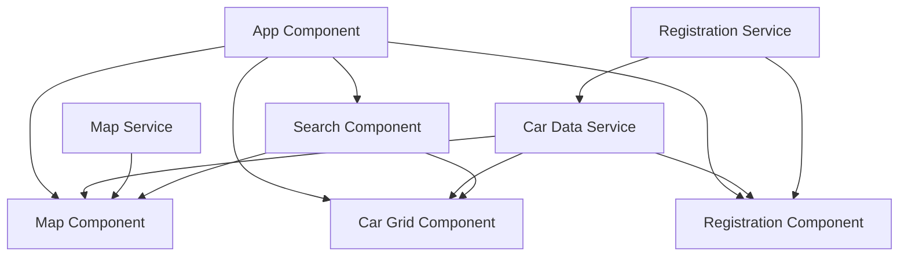

# Car Rental Tracking Application - Technical Specification

## Component Diagram



## Data Models

### Car Entity
```typescript
interface Car {
  id: string;           // Unique identifier for the car
  name: string;         // Display name of the car
  latitude: number;     // Current latitude position
  longitude: number;    // Current longitude position
  status: CarStatus;    // Current status of the car
  model?: string;       // Optional car model information
  year?: number;        // Optional manufacturing year
  licensePlate?: string; // Optional license plate number
  lastUpdated: Date;    // Timestamp of last location update
}

enum CarStatus {
  AVAILABLE = 'available',
  RENTED = 'rented',
  MAINTENANCE = 'maintenance',
  INACTIVE = 'inactive'
}
```

### User Entity (for Registration)
```typescript
interface User {
  id: string;           // Unique identifier for the user
  name: string;         // User's name
  email: string;        // User's email address
  phone?: string;       // Optional phone number
  registeredCars: string[]; // Array of car IDs registered to this user
}
```

## API Endpoints

The application would interact with a backend service through the following RESTful API endpoints:

### Car Management
- `GET /api/cars` - Retrieve all cars
- `GET /api/cars/:id` - Retrieve a specific car by ID
- `POST /api/cars` - Create a new car entry
- `PUT /api/cars/:id` - Update a car's information
- `DELETE /api/cars/:id` - Remove a car from the system

### User Management
- `GET /api/users` - Retrieve all users
- `GET /api/users/:id` - Retrieve a specific user
- `POST /api/users` - Register a new user
- `PUT /api/users/:id` - Update user information
- `POST /api/users/:id/cars/:carId` - Register a car to a user
- `DELETE /api/users/:id/cars/:carId` - Unregister a car from a user

### Location Updates
- `POST /api/cars/:id/location` - Update a car's location
- `GET /api/cars/locations` - Get all car locations (optimized endpoint)

## Zone-less Angular Implementation Details

### Bootstrap Configuration
```typescript
// main.ts
import { bootstrapApplication } from '@angular/platform-browser';
import { AppComponent } from './app/app.component';
import { appConfig } from './app/app.config';

bootstrapApplication(AppComponent, {
  ...appConfig,
  providers: [
    ...appConfig.providers,
    { provide: NgZone, useValue: new NoopNgZone() }
  ]
}).catch(err => console.error(err));
```

### Manual Change Detection
```typescript
// Example component with manual change detection
import { Component, ChangeDetectorRef, inject } from '@angular/core';

@Component({
  selector: 'app-car-grid',
  templateUrl: './car-grid.component.html',
  changeDetection: ChangeDetectionStrategy.OnPush
})
export class CarGridComponent {
  private cdr = inject(ChangeDetectorRef);
  
  // When data changes and needs to be reflected in the UI
  updateGrid(cars: Car[]): void {
    this.cars = cars;
    this.cdr.detectChanges();
  }
}
```

### Signal-based State Management
```typescript
// car-data.service.ts
import { Injectable, signal, computed } from '@angular/core';

@Injectable({
  providedIn: 'root'
})
export class CarDataService {
  // Signal for the collection of cars
  private carsSignal = signal<Car[]>([]);
  
  // Computed signal for available cars
  public availableCars = computed(() => 
    this.carsSignal().filter(car => car.status === CarStatus.AVAILABLE)
  );
  
  // Method to update cars
  updateCars(cars: Car[]): void {
    this.carsSignal.set(cars);
  }
  
  // Method to update a single car
  updateCar(updatedCar: Car): void {
    this.carsSignal.update(cars => 
      cars.map(car => car.id === updatedCar.id ? updatedCar : car)
    );
  }
}
```

## AG Grid Integration

### Grid Configuration
```typescript
// car-grid.component.ts
import { Component, signal } from '@angular/core';
import { ColDef } from 'ag-grid-community';

@Component({
  selector: 'app-car-grid',
  template: `
    <ag-grid-angular
      class="ag-theme-alpine"
      [rowData]="cars()"
      [columnDefs]="columnDefs"
      [pagination]="true"
      [paginationAutoPageSize]="true"
      (gridReady)="onGridReady($event)"
      (rowSelected)="onRowSelected($event)">
    </ag-grid-angular>
  `
})
export class CarGridComponent {
  cars = signal<Car[]>([]);
  
  columnDefs: ColDef[] = [
    { field: 'id', headerName: 'Car ID', sortable: true, filter: true },
    { field: 'name', headerName: 'Car Name', sortable: true, filter: true },
    { field: 'latitude', headerName: 'Latitude', sortable: true, filter: true },
    { field: 'longitude', headerName: 'Longitude', sortable: true, filter: true },
    { field: 'status', headerName: 'Status', sortable: true, filter: true },
    { field: 'lastUpdated', headerName: 'Last Updated', sortable: true, filter: true,
      valueFormatter: params => new Date(params.value).toLocaleString() }
  ];
  
  // Grid events and methods...
}
```

## Map Integration with Leaflet

```typescript
// map.component.ts
import { Component, AfterViewInit, signal, inject } from '@angular/core';
import * as L from 'leaflet';
import { CarDataService } from '../services/car-data.service';

@Component({
  selector: 'app-map',
  template: '<div id="map"></div>',
  styles: [`
    #map { height: 500px; width: 100%; }
  `]
})
export class MapComponent implements AfterViewInit {
  private map: L.Map;
  private markers = new Map<string, L.Marker>();
  private carDataService = inject(CarDataService);
  
  ngAfterViewInit(): void {
    this.initializeMap();
    
    // Subscribe to car data changes
    effect(() => {
      const cars = this.carDataService.availableCars();
      this.updateMarkers(cars);
    });
  }
  
  private initializeMap(): void {
    this.map = L.map('map').setView([51.505, -0.09], 13);
    
    L.tileLayer('https://{s}.tile.openstreetmap.org/{z}/{x}/{y}.png', {
      attribution: '© OpenStreetMap contributors'
    }).addTo(this.map);
  }
  
  private updateMarkers(cars: Car[]): void {
    // Update existing markers and add new ones
    cars.forEach(car => {
      const position = L.latLng(car.latitude, car.longitude);
      
      if (this.markers.has(car.id)) {
        // Update existing marker
        this.markers.get(car.id).setLatLng(position);
      } else {
        // Create new marker
        const marker = L.marker(position)
          .bindPopup(`<b>${car.name}</b><br>ID: ${car.id}<br>Status: ${car.status}`)
          .addTo(this.map);
          
        this.markers.set(car.id, marker);
      }
    });
    
    // Remove markers for cars that no longer exist
    this.markers.forEach((marker, id) => {
      if (!cars.some(car => car.id === id)) {
        this.map.removeLayer(marker);
        this.markers.delete(id);
      }
    });
  }
}
```

## Draggable Registration Component

```typescript
// registration.component.ts
import { Component, signal } from '@angular/core';
import { CdkDragDrop } from '@angular/cdk/drag-drop';

@Component({
  selector: 'app-registration',
  template: `
    <div class="registration-panel" 
         cdkDrag 
         [cdkDragDisabled]="!isDraggable()"
         (cdkDragDropped)="onDragDropped($event)">
      <div class="panel-header" cdkDragHandle>
        <h3>Car Registration</h3>
        <button (click)="toggleMinimize()">{{ isMinimized() ? 'Expand' : 'Minimize' }}</button>
      </div>
      
      <div class="panel-content" *ngIf="!isMinimized()">
        <!-- Registration form -->
        <form [formGroup]="registrationForm" (ngSubmit)="onSubmit()">
          <!-- Form fields -->
        </form>
      </div>
    </div>
  `,
  styles: [`
    .registration-panel {
      position: absolute;
      left: 20px;
      top: 20px;
      width: 300px;
      background: white;
      border-radius: 4px;
      box-shadow: 0 2px 8px rgba(0,0,0,0.2);
      z-index: 1000;
    }
    
    .panel-header {
      display: flex;
      justify-content: space-between;
      align-items: center;
      padding: 10px;
      background: #f5f5f5;
      border-radius: 4px 4px 0 0;
      cursor: move;
    }
    
    .panel-content {
      padding: 15px;
    }
  `]
})
export class RegistrationComponent {
  isMinimized = signal(false);
  isDraggable = signal(true);
  
  toggleMinimize(): void {
    this.isMinimized.update(value => !value);
  }
  
  onDragDropped(event: CdkDragDrop<any>): void {
    // Save position if needed
  }
  
  // Form handling methods...
}
```

## Responsive Layout Strategy

The application will use CSS Grid for the main layout, with the following structure:

```css
.app-container {
  display: grid;
  height: 100vh;
  grid-template-areas:
    "registration map map"
    "registration map map"
    "grid grid grid";
  grid-template-rows: 1fr 1fr 300px;
  grid-template-columns: 300px 1fr 1fr;
}

.map-container {
  grid-area: map;
}

.grid-container {
  grid-area: grid;
}

.registration-container {
  grid-area: registration;
}

/* Responsive adjustments */
@media (max-width: 768px) {
  .app-container {
    grid-template-areas:
      "map map"
      "grid grid";
    grid-template-rows: 1fr 300px;
    grid-template-columns: 1fr 1fr;
  }
  
  .registration-container {
    position: absolute;
    z-index: 1000;
    /* Default to minimized on mobile */
  }
}
```

## Performance Considerations

1. **Virtual DOM for AG Grid**
   - Configure AG Grid with row virtualization for handling large datasets
   - Implement pagination to limit the number of rows rendered at once

2. **Map Optimization**
   - Use marker clustering for large numbers of cars
   - Implement lazy loading of map tiles
   - Consider using WebGL rendering for better performance

3. **Change Detection Strategy**
   - Use OnPush change detection for all components
   - Implement manual change detection where needed
   - Utilize signals for efficient state updates

4. **Data Loading**
   - Implement pagination and filtering on the server side
   - Use websockets for real-time updates instead of polling
   - Cache frequently accessed data